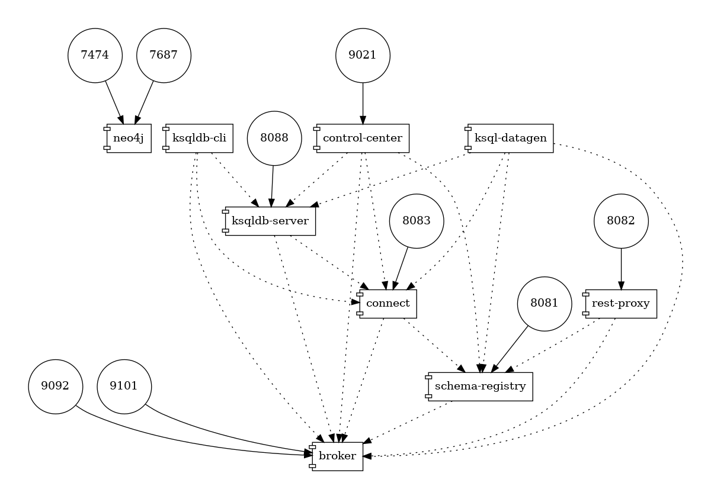

# Kafka Connect Neo4j Connector Demo

## Introduction

This repo contains a Docker Compose stack adapted from [the official Neo4j's Kafka Connect Neo4j connector](https://neo4j.com/docs/kafka/quickstart-connect/) that works properly and uses the latest releases from Confluent Platform (7.5.3) & Neo4j Enterprise (5.16.x). The original Docker compose from the documentation is outdated and from my experience has an issue with the `connect` container.  

Container diagram:



## How to use 

For more detailed explanation, please refer to the [official Neo4j documentation](https://neo4j.com/docs/kafka/quickstart-connect/).

### Create the stack
```bash
docker compose up -d
```

### Configure Source instance

Inspect [source.neo4j.json](./source.neo4j.json) first before running this command.

```bash
curl -X POST http://localhost:8083/connectors \
  -H "Content-Type:application/json" \
  -H "Accept:application/json" \
  -d @source.neo4j.json
```

### Configure Sink instance

Inspect [sink.neo4j.json](./sink.neo4j.json) first before running this command.

```bash
curl -X POST http://localhost:8083/connectors \
  -H "Content-Type:application/json" \
  -H "Accept:application/json" \
  -d @sink.neo4j.json
```

### Clean up the running containers and the network
```bash
docker compose down
```